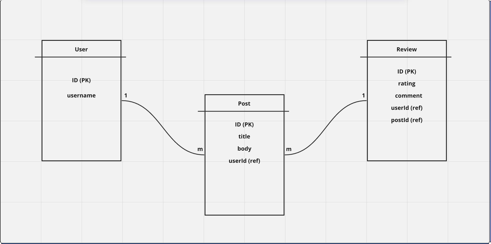

# Social Media Timeline Application

## Overview

This application provides a platform for users to post stories to their timeline, review posts, and view top-rated posts. It includes APIs for adding posts, listing user posts with pagination, listing top posts with pagination, and adding reviews to posts. The system also includes test cases for critical components and is optimized for performance, aiming for an average response time below 100ms on an average machine.

## Features

1. **API to Add a Post**: Allows users to create and post stories with a title and body to their timeline.
2. **API to List User Posts with Pagination**: Enables users to view their own timeline with pagination support.
3. **API to List Top Posts with Pagination**: Allows users to discover top-rated posts across the platform, with pagination support.
4. **API to Add a Review to a Post**: Users can review posts, giving them a rating out of 5 along with a mandatory comment. Multiple users can review the same post simultaneously.
5. **Test Cases**: Includes comprehensive test cases covering critical functionalities, ensuring system reliability and correctness.
6. **Database Seeding**: Seeds the database with 50k posts and more than 20k reviews for testing and performance evaluation purposes.
7. **No Authentication**: The system does not require authentication or detailed user information, maintaining simplicity.

## Implementation Details

### Queue Data Structure

The application uses an array-based implementation of a queue data structure for managing tasks such as adding and listing posts. Enqueue and Dequeue operations have a time complexity of O(1).

### Max Priority Queue

For managing top posts, a max priority queue is implemented using arrays. Enqueue operation remains O(1) while Dequeue operation becomes O(n) due to the need to find the maximum priority element.

### SQL Query for Second Highest Salary

A SQL query is provided to retrieve the second-highest salary from the Employee table. It returns NULL if there is no second-highest salary.

### Finding Middle Node of Singly Linked List

A function is implemented to find the middle node of a singly linked list. It returns the second middle node if there are two middle nodes. The time complexity is O(n) and space complexity is O(1).

### Entity-Relationship Diagram (ERD)

An ERD diagram is included to illustrate the database schema and relationships between entities.

## Getting Started

To get started with the application, follow these steps:

1. Clone the repository to your local machine.
2. Install any necessary dependencies.
3. Set up the database.
4. Run the application.
5. Use the provided APIs to interact with the system.
